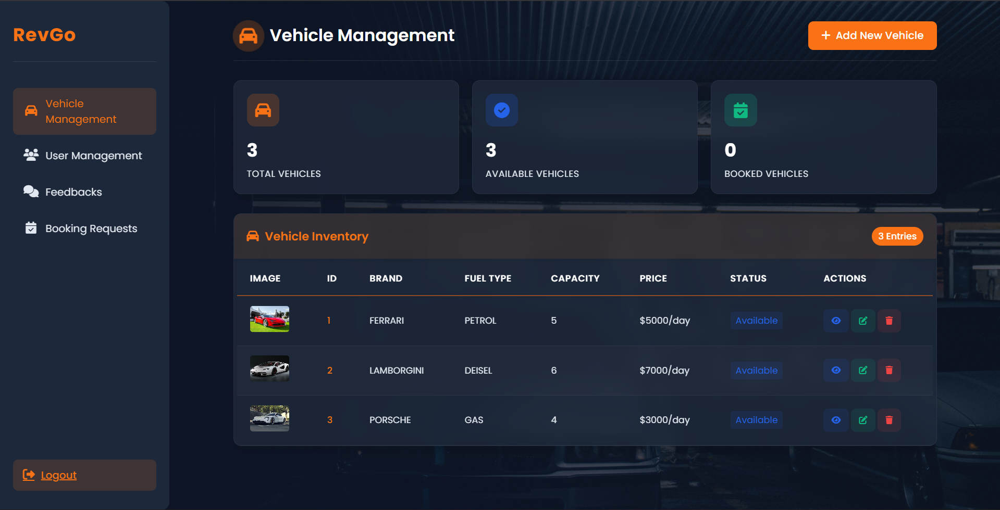
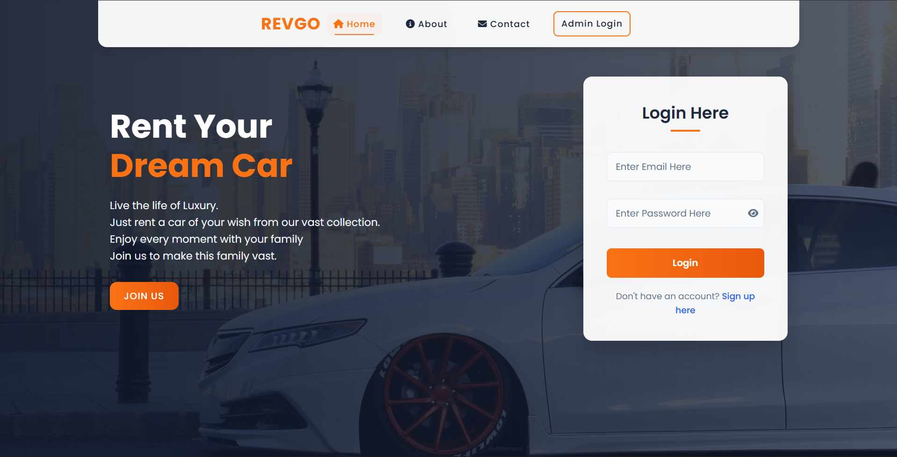
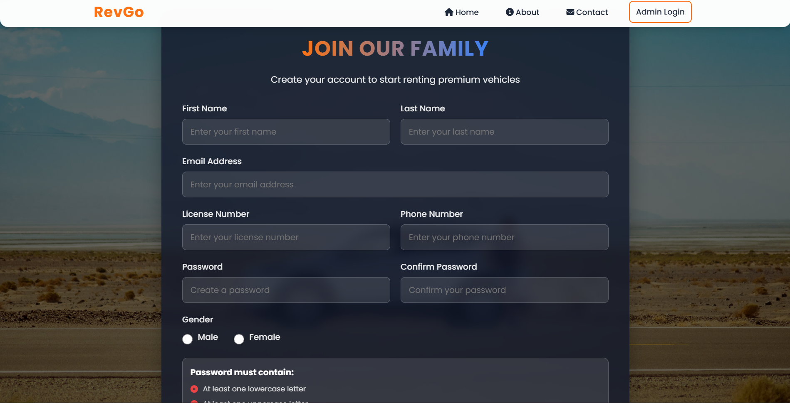
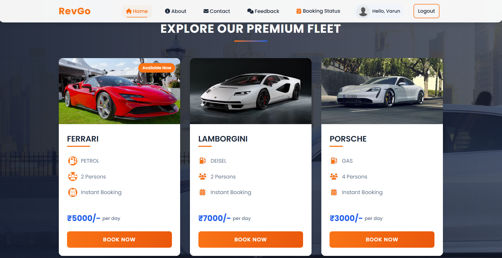
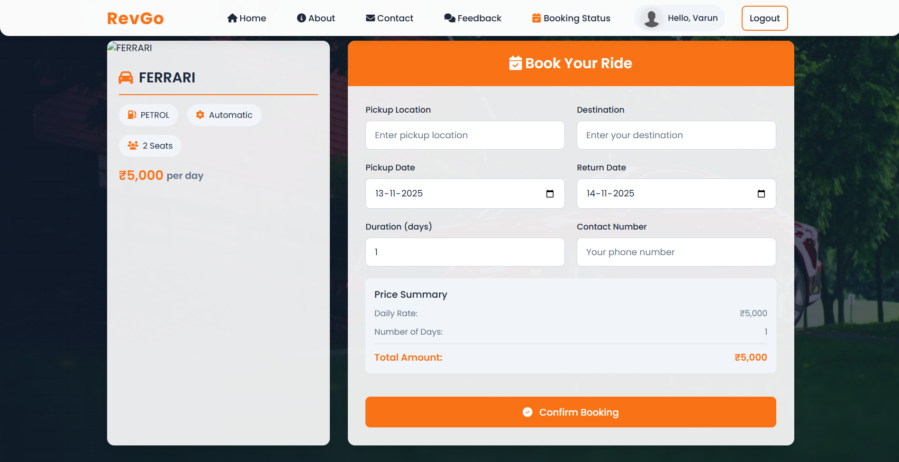

<!-- 

  

 -->

<h1 align="center">🚗 RevGo – Car Rental Website Project</h1>

A complete Car Rental System built as a College Mini Project using HTML, CSS, JavaScript, PHP & MySQL.

---

## 📑 Table of Contents
- [Introduction](#introduction)
- [Features](#features)
- [Screenshots](#screenshots)
- [Requirements](#requirements)
- [Installation](#installation)
- [Database](#database)
- [Database Tables](#database-tables)
- [User Story](#user-story)
- [Admin Panel](#admin-panel)
- [Demo](#demo)
- [Author](#author)
- [Show your support](#show-your-support)

---

## 🎯 Introduction

RevGo is a clean and fully functional **Car Rental Management System** developed for a college mini project.  
It includes:

- A **User Website**  
- A **Secure Admin Dashboard**  
- A complete **Car Booking System**  
- A responsive and modern UI  

Users can browse cars, reserve vehicles, check booking status, and give feedback.  
Admins can manage cars, users, bookings, and feedbacks.

---

## ✨ Features

### 👤 User Features
- User Registration & Login  
- View available premium cars  
- Search cars  
- Instant Booking  
- Booking summary  
- Booking status page  
- Give feedback  
- Logout system  

### 🛠 Admin Features
- Admin Login  
- Add / Edit / Delete vehicles  
- Manage user accounts  
- Manage feedback  
- Approve / Reject bookings  
- View booking requests  
- Change vehicle availability  
- Dashboard statistics  

### 🚘 Car Rental System Functions
- Car pricing per day  
- Automatic cost calculation  
- Real-time availability status  
- Displays only available cars to users  

---

## 🖼 Screenshots

> Replace these paths with GitHub raw URLs after uploading images.

### 🔹 Admin Dashboard

### 🔹 User Home + Login

### 🔹 Registration Page

### 🔹 Car Listing (Premium Fleet)

### 🔹 Booking Page

---

## 📌 Requirements

- XAMPP / WAMP Server  
- PHP 7+  
- MySQL Database  
- Browser (Chrome recommended)  

---

## ⚙️ Installation

1. **Install XAMPP**  
2. Start **Apache** & **MySQL**  
3. Clone the project into: xampp/htdocs

4. Import the SQL file located in the `/database` folder:
- Open **phpMyAdmin**
- Create a database: `carproject`
- Import `carproject.sql`
5. Open the project in browser:

✔ Done! The project is now running.

---

## 🗄 Database

- DB Name: **car_project**
- Stored in `/database/carproject.sql`
- Used with **MySQL**

---

## 👥 User Story

- As a user, I can explore all available cars  
- I can check car details  
- I can book a car instantly  
- I can view my booking status  
- I can cancel or check updates  
- I can send feedback about my experience  

---

## 🛡 Admin Panel

The Admin Panel includes:

- Dashboard Overview  
- Vehicle Management  
- User Management  
- Booking Requests  
- Feedback System  
- Add / Edit / Delete cars  
- Approve or Reject reservations  

Admin can fully control and monitor the rental system.

---

## 🌐 Demo

Live Demo (Example):
- https://carsminiproject.000webhostapp.com/  

---

## 👨‍💻 Author

**Varun Acharya**  
GitHub: https://github.com/Varunacharya-VRN  

---

## ⭐ Show your support

If this project helped you, please give it a **⭐️** on GitHub!

---

